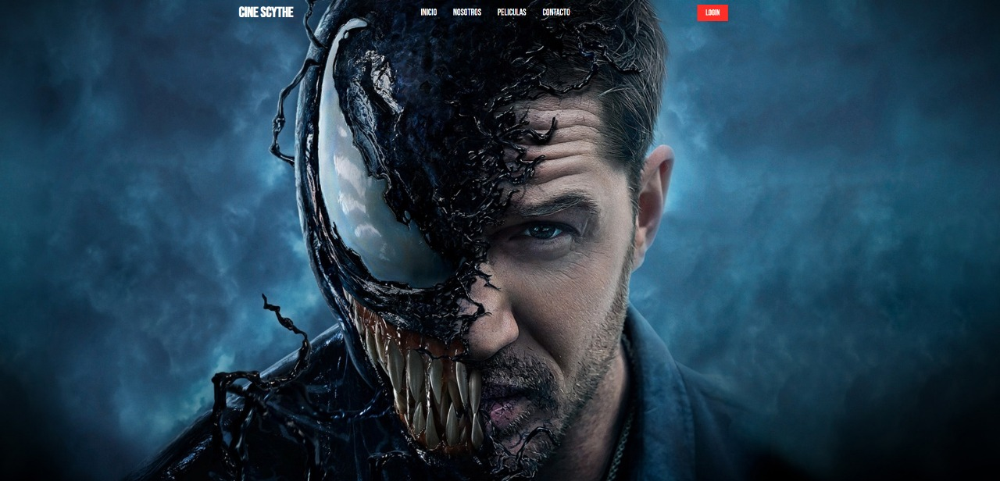

# 🌟 Cine Scythe - Plantilla Estática para Sitio de Peliculas 🌟

📢 **Bienvenido/a a **, una plantilla web estática para restaurantes creada con **HTML, CSS y JavaScript puro**.

<p align="center">
  
  <br>
  
</p>

---

## 🚀 **Características**

✔️ Diseño responsivo y adaptable para dispositivos móviles
✔️ Animaciones suaves con CSS 
✔️ Secciones personalizables (Inicio, Nosotros, Peliculas, Contacto)  

---

## 📂 **Estructura del Proyecto**

```bash
📦 foodfast/
 ┣ 📂 imagenes/            # Recursos de imágenes
 ┣ 📂 css/            # Estilos CSS
 ┣ 📜 index.html      # Página principal
```

🛠 Tecnologías Utilizadas

- HTML5
- CSS3 Moderno (Flexbox y Grid, Anidamiento, Variables)
